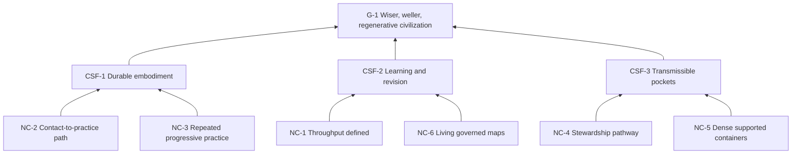

# Goal Tree

## Purpose

State the enduring conditions that must exist for the Second Renaissance group to contribute to its provisional goal.

## Entities

**Goal**

- G-1 — Co-initiate a conscious transformation toward a wiser, weller, regenerative civilization. Provisional; high confidence as document intent.

**Critical Success Factors**

- CSF-1 — People durably embody wiser views, values, practices, and ways of acting.
- CSF-2 — The group learns and revises strategy through evidence, objections, and constraint review.
- CSF-3 — Proven practices stabilize in pockets and become responsibly transmissible.

**Necessary Conditions**

- NC-1 — Goal-relevant throughput is operationally defined without reducing transformation to activity counts.
- NC-2 — A transparent path connects first contact to sustained practice and contribution.
- NC-3 — Participants can repeat embodied practices at progressively deeper levels.
- NC-4 — Contributors can develop into facilitators and accountable stewards.
- NC-5 — Dense practice containers receive sangha support and remain outward-facing.
- NC-6 — Strategic maps are governed as living, challengeable, versioned commons.

## Logical connections

- L-001–L-003: each CSF is necessary for G-1.
- L-004 and L-009: NC-1 and NC-6 are necessary for learning and revision.
- L-005 and L-006: NC-2 and NC-3 are necessary for durable embodiment.
- L-007 and L-008: NC-4 and NC-5 are necessary for transmissible pockets.

Necessity test: if embodiment exists without learning, the group may preserve error; if learning exists without stable practice, it produces analysis rather than cultural change; if pockets exist without transmission, the change remains isolated.

## Evidence

EVD-1 and EVD-2 establish the authored goal and durable-adoption standard. EVD-4 and EVD-8–EVD-18 support the necessary conditions.

## Assumptions

- ASM-1: the documents represent an intended operating model.
- ASM-5–ASM-7: embodiment, learning, and transmission are all necessary for the goal.

## Confidence

High for fidelity to the documents; medium-to-low for empirical necessity until the group challenges the hierarchy.

## Open reservations

- Is civilizational transformation too broad to guide one group’s operating decisions?
- Are all three CSFs necessary, and are important conditions such as resources, safety, legitimacy, or resilience missing?
- Which beneficiary and time horizon define success?

## Diagram

Text: NC-1 and NC-6 support learning; NC-2 and NC-3 support embodiment; NC-4 and NC-5 support transmissible pockets; all three CSFs are necessary for G-1.

## Cross-tree references

NC-1 is threatened by RC-2 and advanced by IO-2. NC-2 is threatened by RC-1 and advanced by IO-3. NC-3–NC-5 are advanced by IO-4–IO-7. NC-6 is advanced by IO-1 and ACT-1.

