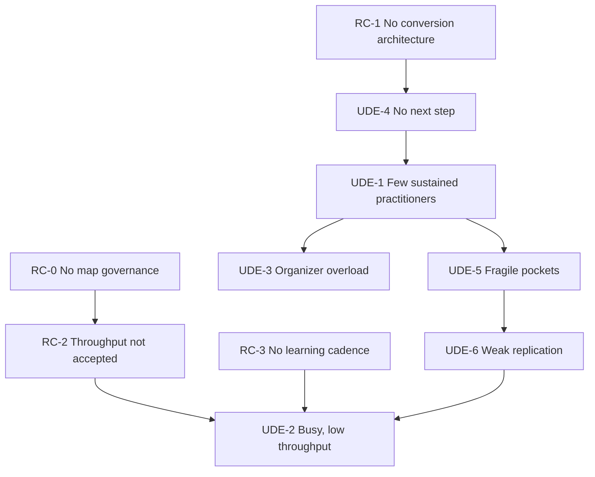

# Current Reality Tree

## Purpose

Explain why resonance may not be becoming durable adoption, while preserving the source document’s explicit uncertainty.

## Entities

**Candidate root causes**

- RC-0 — No agreed process for validating and revising strategic maps.
- RC-1 — No reliable conversion architecture from interest through replication.
- RC-2 — Throughput is not operationally defined and accepted.
- RC-3 — No disciplined practice-action-learning and constraint-review cadence.

**Candidate UDEs**

- UDE-1 — Many people resonate but few enter sustained practice.
- UDE-2 — The group is busy while durable-adoption throughput remains low.
- UDE-3 — Core organizers carry too much work and risk burnout.
- UDE-4 — New participants do not know the next step.
- UDE-5 — Pockets are difficult to form and remain fragile or isolated.
- UDE-6 — Others admire the work without reproducing it.

All UDEs are provisional because no lived observations were supplied.

## Logical connections

```text
RC-0 → RC-2 → UDE-2
RC-3 ─────────→ UDE-2

RC-1 → UDE-4 → UDE-1 → UDE-3
                        └────→ UDE-5 → UDE-6 → UDE-2
```

Important readings:

- L-013: If no staged conversion architecture exists, then new participants lack a next step, because public contact is not connected to an actionable practice stage.
- L-014: If participants lack a next step, fewer enter sustained practice, assuming a next-step gap is a material source of drop-off.
- L-016: If too few people sustain practice, dense containers are harder to form, assuming practitioners and facilitators are necessary inputs.
- L-017: If pockets remain fragile, independent replication is weak, because too few mature patterns and carriers exist.

## Evidence

EVD-3 lists the UDEs. EVD-4 lists the root-cause candidates. EVD-5 labels RC-1 the likely constraint. EVD-6 requires lived validation before these are treated as current reality.

## Assumptions

ASM-2–ASM-16, especially:

- awareness is not the tighter constraint;
- drop-off is caused materially by pathway design;
- organizer overload follows from insufficient participant development;
- stable pockets are needed for replication.

## Confidence

Medium for fidelity to the supplied CRT; low-to-medium for entity existence and causal sufficiency in the actual group.

## Open reservations

- Entity existence: are UDE-1–UDE-6 observed now?
- Additional cause: funding, safeguarding, legitimacy, time, trust, or external context may dominate.
- Cause insufficiency: an entry pathway alone may not create practice.
- Cause-effect reversal: weak pockets may cause weak practice conversion as well as result from it.
- Boundary: some UDEs may belong to a broader movement, not one group.

## Diagram



## Cross-tree references

RC-1 is addressed by INJ-3. RC-2 is addressed by INJ-2. RC-3 is addressed by INJ-4. RC-0 is addressed by INJ-0 and ACT-1.

