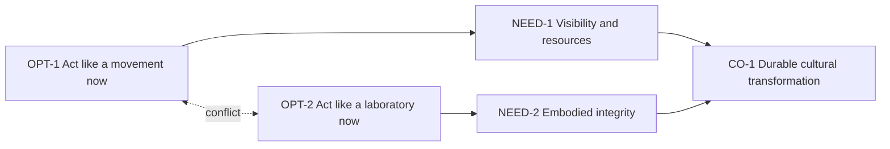

# Evaporating Cloud

## Purpose

Expose the assumptions making visibility and embodied integrity appear incompatible.

## Entities

- CO-1 / A — Increase durable cultural transformation.
- NEED-1 / B — Become visible enough to attract people, resources, energy, and legitimacy.
- NEED-2 / C — Become embodied enough to represent the new paradigm with integrity.
- OPT-1 / D — Act like a movement now: scale, speed, message, accessibility.
- OPT-2 / D′ — Act like a monastery or laboratory now: depth, slowness, practice, rigor.

## Logical connections

- L-019: NEED-1 is necessary for CO-1.
- L-020: NEED-2 is necessary for CO-1.
- L-021: OPT-1 is believed necessary for NEED-1.
- L-022: OPT-2 is believed necessary for NEED-2.
- L-023: OPT-1 conflicts with OPT-2 as currently understood.

## Evidence

EVD-7 supplies the cloud and its core injection.

## Assumptions

- ASM-17: visibility requires movement-like prioritization now.
- ASM-18: integrity requires laboratory-like prioritization now.
- ASM-19: both modes consume the same scarce capacity and cannot be staged or integrated.

## Conflict-breaking direction

**INJ-1:** Organize a broad public invitation around deep, protected, practice-based pockets.

The injection changes the system architecture: public reach feeds practice; deep practice produces future facilitators, examples, and transmission. Different elements scale at different maturity levels.

## Confidence

High that this matches the source; medium that it is the group’s most important persistent conflict.

## Open reservations

- Are visibility and embodiment both genuinely necessary now, or can one lead?
- Is organizer capacity the actual shared scarce resource?
- Does “monastery/laboratory” language create accessibility or cultural risks?
- Can protected pockets remain outward-facing?

## Diagram

Text: both needs serve the same objective; each is believed to require an incompatible operating mode. INJ-1 reframes reach and depth as connected stages.

## Cross-tree references

INJ-1 appears in the Future Reality and Prerequisite views. NBR-2 and the outward-service control test whether the reframing creates manipulation or insularity.

