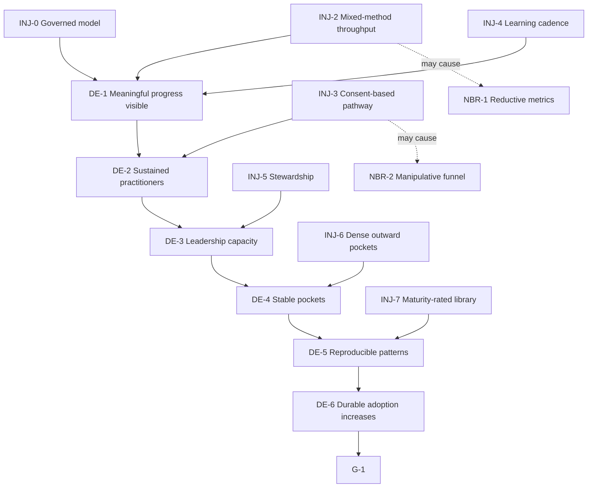

# Future Reality Tree

## Purpose

Test whether the proposed operating-system injections could turn resonance into durable adoption and identify consequences that must be trimmed.

## Entities

**Injections**

- INJ-0 — Govern the trees with stewardship and revision.
- INJ-1 — Build reach around protected practice pockets.
- INJ-2 — Define mixed-method durable-adoption throughput.
- INJ-3 — Build a transparent, consent-based staged conversion architecture.
- INJ-4 — Install a practice-action-learning and constraint-review cadence.
- INJ-5 — Create graduated stewardship.
- INJ-6 — Build dense, outward-facing pocket/sangha containers.
- INJ-7 — Create a maturity-rated, adaptable replication library.

**Desirable effects**

- DE-1 — Transformation is distinguished from visible activity.
- DE-2 — More people sustain embodied practice.
- DE-3 — Leadership capacity grows.
- DE-4 — Stable outward-facing pockets form.
- DE-5 — Mature practices become independently reproducible.
- DE-6 — Verified durable adoption increases.

## Logical connections

```text
INJ-0 + INJ-2 + INJ-4 → DE-1
INJ-3                  → DE-2
INJ-5                  → DE-3
INJ-6                  → DE-4
INJ-7                  → DE-5

DE-1 → DE-2 → DE-3 → DE-4 → DE-5 → DE-6 → G-1
```

The chain is contributory, not claimed sufficient. Each arrow depends on explicit assumptions in `ltp-model.yaml`.

## Evidence

EVD-7–EVD-11 provide the injections, intended effects, and negative branches.

## Assumptions

ASM-20–ASM-26. The decisive uncertainties are whether pathway design changes practice entry, whether apprenticeship distributes quality leadership, and whether pockets generate portable learning.

## Negative-branch analysis

### NBR-1 — Metrics become reductive

```text
INJ-2 → counted adoption events dominate attention
→ subtle inner and relational change is neglected
```

Trim: mixed quantitative and qualitative evidence, peer discernment, stories, and periodic wisdom review. Treat the metric as a decision aid, not the goal.

### NBR-2 — Conversion becomes manipulative

```text
INJ-3 → people feel recruited or funneled
→ trust falls
```

Trim: informed choice at each stage, no-pressure invitations, explicit commitments and rights, easy pause/exit, and observation of declines as valid evidence.

### Additional preserved branches

- Layered participation can create status hierarchy. Trim with responsibility-not-worth norms and accountable criteria.
- Dense pockets can become insular. Trim with outward service and sangha relationships.
- Replication can scale shallow copies. Trim with maturity ratings and adaptation principles.

## Confidence

Medium. The logic is coherent and risk-aware, but no injection has implementation evidence in the supplied scope.

## Open reservations

- Which injection set is minimally sufficient?
- Could model governance slow action without improving decisions?
- What protected floors constrain throughput optimization?
- Which effects are observable within one learning cycle?

## Diagram



## Cross-tree references

INJ-0–INJ-7 address RC-0–RC-3 and the UDE chain. IO-1–IO-7 provide their prerequisites. ACT-1–ACT-4 begin testing the first four.

