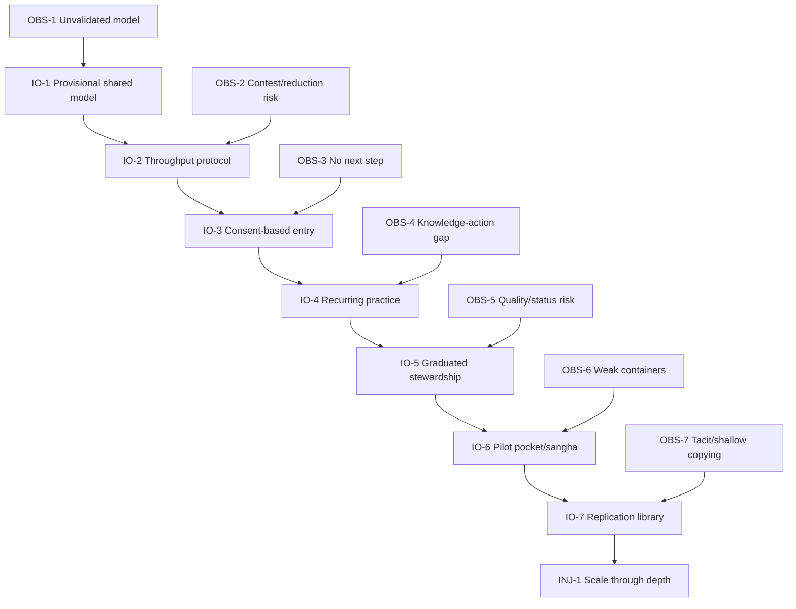

# Prerequisite Tree

## Purpose

Order the conditions that must exist before the group responsibly scales or replicates the proposed operating system.

## Entities

| Obstacle | Intermediate objective |
|---|---|
| OBS-1 — Goal, UDEs, and arrows are not validated | IO-1 — Stewarded model accepted for provisional use |
| OBS-2 — Throughput may be contested or reductive | IO-2 — Mixed-method throughput protocol accepted |
| OBS-3 — People lack a next step and may resist funneling | IO-3 — Transparent consent-based entry pathway exists |
| OBS-4 — Intellectual agreement does not change practice | IO-4 — Recurring progressive practice exists |
| OBS-5 — Delegation risks quality or status hierarchy | IO-5 — Accountable graduated stewardship exists |
| OBS-6 — Values are hard to sustain without containers | IO-6 — Outward-facing pilot pocket/sangha operates |
| OBS-7 — Practices remain tacit or spread shallowly | IO-7 — Maturity-rated adaptable library exists |

## Logical connections

```text
OBS-1 is overcome by IO-1
IO-1 enables IO-2
OBS-2 is overcome by IO-2
IO-2 enables IO-3
OBS-3 is overcome by IO-3
IO-3 enables IO-4
OBS-4 is overcome by IO-4
IO-4 enables IO-5
OBS-5 is overcome by IO-5
IO-5 enables IO-6
OBS-6 is overcome by IO-6
IO-6 enables IO-7
OBS-7 is overcome by IO-7
IO-7 enables INJ-1
```

This chain is a priority spine, not a claim that later learning must wait entirely for earlier work. Small downstream probes may run when they do not pre-empt the governance and evidence questions.

## Evidence

EVD-11–EVD-18. The supplied PRT explicitly starts its key chain with update governance and provisional validation.

## Assumptions

- A model that lacks standing cannot safely define group throughput.
- A throughput definition is needed to evaluate entry experiments.
- Real entry observations are needed before investing in full practice architecture.
- Practice evidence is needed before formalizing stewardship and replication.

## Confidence

High that IO-1 is the earliest prerequisite in the source; medium for the strict order of all later objectives.

## Open reservations

- Some work can be concurrent: safeguarding and facilitator standards may need to start before any practice pilot.
- Funding or ownership could precede every modeled objective.
- The group may already satisfy parts of the chain; no state evidence was supplied.

## Diagram



## Cross-tree references

Each IO enables an injection or desired effect in the FRT. ACT-1–ACT-4 operationalize IO-1–IO-4.

