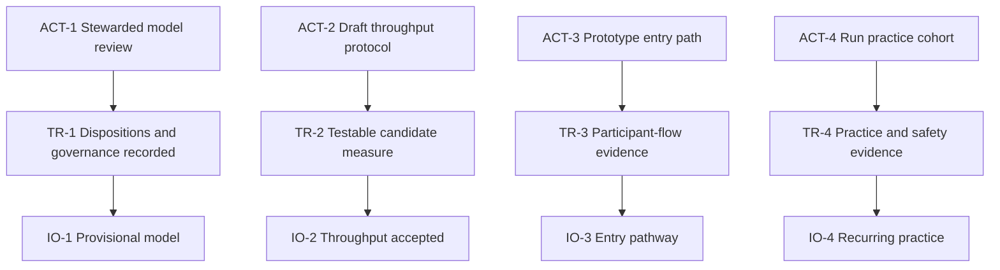

# Transition Tree

## Purpose

Convert the earliest prerequisite objectives into actions with observable effects. This view is inferred because the supplied source set explicitly stops before a Transition Tree.

## Transition 1 — Validate the shared model

**Transition ID:** ACT-1 / TR-1  
**Current reality:** The authored CRT is provisional; no lived evidence or group disposition is attached to its UDEs and arrows.  
**Need:** A model with enough standing to guide experiments without treating authorship as confirmation.  
**Action:** Facilitate one bounded stewarded review of G-1, the priority UDEs, and the RC-1 conversion-constraint hypothesis. Use a versioned change proposal and objection log.  
**Expected immediate effect:** TR-1 — A dated model records confirmations, disputes, evidence gaps, a named steward, decision rules, and the next review.  
**Expected contribution:** Achieves IO-1 and makes a throughput review legitimate.  
**Prerequisites:** Invite affected participants; circulate the model; define “provisional use”; preserve minority reports.  
**Verification:** Every reviewed entity has a disposition; objections have owners or explicit deferral; steward and review date are recorded.  
**Likely scope:** `ltp/ltp-model.yaml`, review notes, decision log.  
**Risk:** Discussion expands indefinitely or false consensus hides disagreement.  
**Rollback/containment:** Time-box the review; retain disputed status; do not promote unreviewed claims to confirmed.  
**Traceability:** OBS-1 → IO-1 → INJ-0 → CSF-2 → G-1.  
**Confidence:** High.

## Transition 2 — Make throughput testable

**Transition ID:** ACT-2 / TR-2  
**Current reality:** Durable adoption is defined rhetorically but not accepted operationally.  
**Need:** A way to judge one experiment without equating activity with transformation.  
**Action:** Draft and review one mixed-method definition of a durable adoption event, including minimum duration, quantitative trace, qualitative evidence, protected floors, and revision conditions.  
**Expected immediate effect:** TR-2 — One candidate metric can be tested without being treated as complete truth.  
**Expected contribution:** Achieves IO-2 and addresses RC-2.  
**Prerequisites:** IO-1; named decision owner; access to representative adoption examples.  
**Verification:** Example events can be classified consistently; non-events and edge cases are documented; qualitative evidence is mandatory.  
**Likely scope:** measurement protocol and review template.  
**Risk:** Goodhart effects and marginalization of subtle change.  
**Rollback/containment:** Pilot-only status; wisdom review; prohibit incentive linkage during the first cycle.  
**Traceability:** OBS-2 → IO-2 → INJ-2 → DE-1 → CSF-2.  
**Confidence:** Medium.

## Transition 3 — Test one entry path

**Transition ID:** ACT-3 / TR-3  
**Current reality:** The proposed staged pathway has no participant-flow evidence.  
**Need:** Distinguish pathway-design failure from other causes of low practice entry.  
**Action:** Prototype one transparent next step from one real public contact into one first practice; state commitments, rights, and exit options.  
**Expected immediate effect:** TR-3 — The group observes where participants accept, decline, pause, or exit.  
**Expected contribution:** Tests IO-3, RC-1, ASM-11, and ASM-12.  
**Prerequisites:** IO-2; safeguarding; facilitator; consent language; event source.  
**Verification:** Invitations, choices, attendance, exits, and qualitative feedback are recorded without pressure.  
**Likely scope:** one event/content artifact, orientation, first-practice session, observation log.  
**Risk:** Manipulative funnel behavior.  
**Rollback/containment:** Explicit no-pressure opt-out; independent feedback channel; stop condition for trust concerns.  
**Traceability:** OBS-3 → IO-3 → INJ-3 → DE-2 → CSF-1.  
**Confidence:** Medium.

## Transition 4 — Test recurring practice

**Transition ID:** ACT-4 / TR-4  
**Current reality:** First contact is not evidence of sustained embodiment.  
**Need:** Learn whether repeated practice creates durable change safely.  
**Action:** Run one short recurring-practice cohort as a documented hypothesis-action-result-learning cycle.  
**Expected immediate effect:** TR-4 — Retention, qualitative practice, safety, and learning evidence exists.  
**Expected contribution:** Tests IO-4 and informs later stewardship and pocket design.  
**Prerequisites:** IO-3; facilitation and safeguarding standards; defined duration; consented observation.  
**Verification:** Attendance alone is insufficient; collect participant-reported and peer-discerned change, adverse effects, exits, and facilitator learning.  
**Likely scope:** cohort curriculum, facilitator guide, evidence log.  
**Risk:** Psychological harm, selection bias, or overclaiming.  
**Rollback/containment:** Referral boundaries, stop conditions, limited claims, and documented adverse events.  
**Traceability:** OBS-4 → IO-4 → NC-3 → CSF-1.  
**Confidence:** Medium.

## Logical connections

Text: each action produces an observable effect that achieves or tests one intermediate objective. ACT-1 is first; later actions depend on what it confirms.

## Open reservations

- Owners, dates, participants, and resources require group decisions.
- ACT-2–ACT-4 should be revised if ACT-1 disputes the goal, UDEs, or constraint.

## Cross-tree references

The transitions advance NC-6, NC-1, NC-2, and NC-3 respectively, and test the first half of the Future Reality chain.

